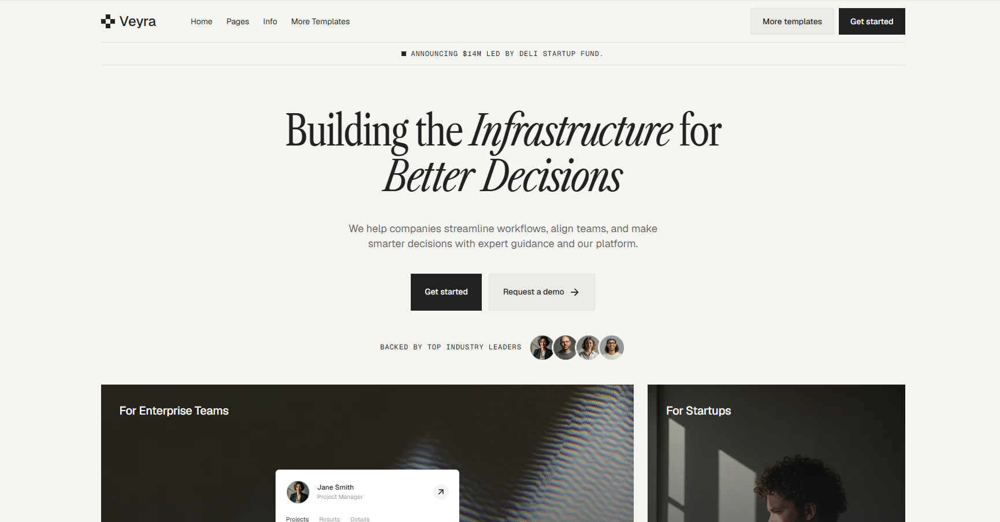
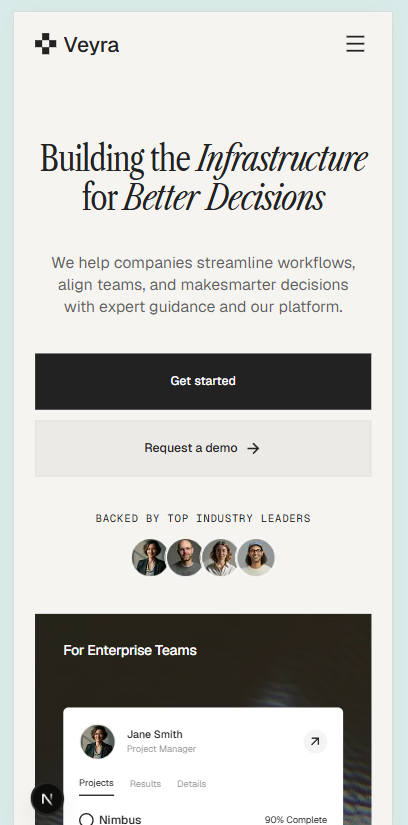

# Veyra — Figma → Next.js 模写

フロントエンドエンジニアとしてのポートフォリオ制作として、FigmaテンプレートをNext.jsで模写したプロジェクトです。

🔗 **デモ:** https://veyra-copying-rui-s-projects8.vercel.app/

---

## 技術スタック

- **Next.js 15**（App Router）
- **TypeScript**
- **Tailwind CSS v4**
- **Vercel**（デプロイ）

## 工夫した点

- FigmaデザインをピクセルレベルでNext.jsに再現
- Tailwind CSS v4の `@theme` を活用したデザイントークン管理
- モバイルファーストのレスポンシブ対応
- カスタムタイポグラフィシステム（Libre Caslon Condensed）
- スライダー・アコーディオン・ハンバーガーメニューなどのインタラクション実装

## セクション構成

Header · Hero · Features · Testimonials · Pricing · News · FAQ · Footer

---

## スクリーンショット

| PC | スマホ |
|----|--------|
|  |  |

---

## 参考デザイン

Figmaテンプレート：[Veyra by UI Deli](https://www.figma.com/community/file/1543272259497127968)